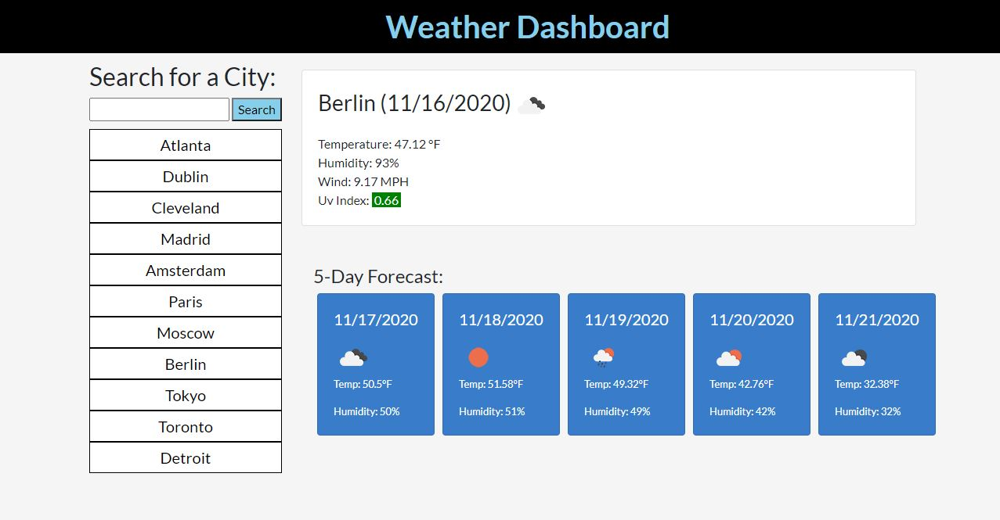

# WeatherDashboard

## Table of Contents
[Description](#description)

[Installation](#installation)

[Usage](#usage)

[Credits](#credits)

## Description
This web app pull data from open weather AI and displays the data. The user can search for a city and retrieve the weather data for that city. The search history is a button panel along the user to access previusly searched location. If a valid location is not found the search query is not added to the search history.

The site appears as follows.

### Start

## Installation

This repository contains all needed downloads.

## Usage
The page can be viewed at https://breakfastitem.github.io/WeatherDashboard/. It can also be viewed by opening index.html with a browser.

## Credits
Author: Andrew Ehrman.

Weather API: https://openweathermap.org/api

Bootstrap: https://getbootstrap.com/ 

Moment.js https://momentjs.com/

Jquery https://jquery.com/